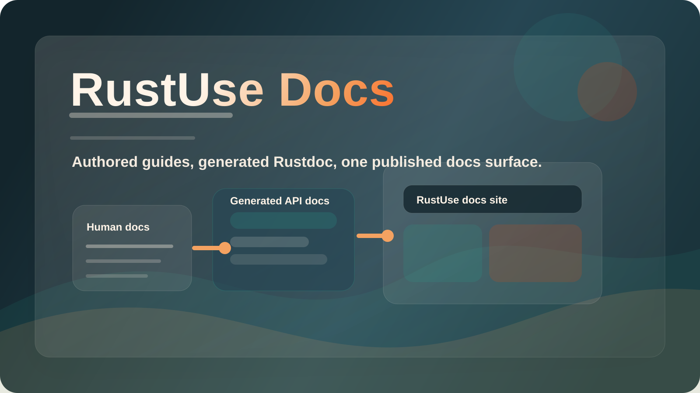
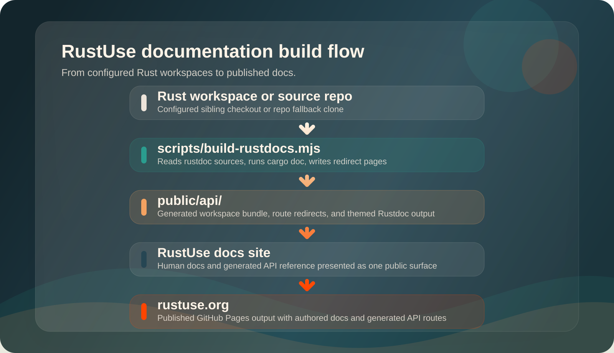

# RustUse Docs

<p align="center">
  
</p>

<p align="center">
  
  
  
  
  
</p>

<p align="center">
  <strong>RustUse documentation and generated API reference</strong><br>
  Human docs live in <code>src/content/docs/</code>. Generated Rust API docs live in <code>public/api/</code>.
</p>

<p align="center">
  <a href="#what-this-repository-contains">Repository</a> ·
  <a href="#documentation-model">Docs model</a> ·
  <a href="#local-development">Local development</a> ·
  <a href="#generated-rust-api-docs">Generated API docs</a> ·
  <a href="#deployment">Deployment</a> ·
  <a href="#troubleshooting">Troubleshooting</a>
</p>

This repository contains the RustUse docs site for `rustuse.org`. It combines human-authored documentation under `src/content/docs/` with generated Rust API docs under `public/api/`, then publishes the static result to GitHub Pages.

<table>
  <tr>
    <td width="33%" valign="top">
      <strong>Edit human docs</strong><br>
      <code>src/content/docs/</code><br>
      Guides, onboarding, set pages, and contributor-facing content.
    </td>
    <td width="33%" valign="top">
      <strong>Refresh generated API docs</strong><br>
      <code>npm run build:api</code><br>
      Rebuilds configured Rustdocs into <code>public/api/</code>.
    </td>
    <td width="33%" valign="top">
      <strong>Refresh LLM inventory</strong><br>
      <code>npm run generate:llms</code><br>
      Keeps <code>public/llms.txt</code> aligned with sibling RustUse workspaces.
    </td>
  </tr>
</table>

## What this repository contains

RustUse Docs is the public docs site, not the source workspace for every Rust crate. It has four primary responsibilities:

| Area                   | Location            | Purpose                                                                                         |
| ---------------------- | ------------------- | ----------------------------------------------------------------------------------------------- |
| Human docs             | `src/content/docs/` | Guides, onboarding, set overviews, and contributor-facing content maintained in this repository |
| Generated API docs     | `public/api/`       | Rustdoc HTML copied in from configured workspaces and treated as build output                   |
| Crate catalog metadata | `src/data/`         | Generated crate listing plus site helpers for publication status, links, and routes             |
| LLM inventory          | `public/llms.txt`   | Generated set and crate link inventory for LLM consumers                                        |

| If you need to...                         | Start here                    |
| ----------------------------------------- | ----------------------------- |
| Write or edit site content                | `src/content/docs/`           |
| Regenerate crate catalog and API inputs   | `npm run sync:crate-surface`  |
| Regenerate the LLM inventory              | `npm run generate:llms`       |
| Rebuild published API routes              | `npm run build:api`           |
| Update crate descriptions, tags, or names | The owning crate `Cargo.toml` |

> [!IMPORTANT]
> Generated Rustdoc HTML belongs in `public/api/`, not `src/content/docs/`.

## Documentation model

RustUse separates authored documentation from generated API output on purpose.

| Content type           | Location            | Source of truth                                                                      |
| ---------------------- | ------------------- | ------------------------------------------------------------------------------------ |
| Human docs             | `src/content/docs/` | This repository                                                                      |
| Generated API docs     | `public/api/`       | Generated `docs/rustdoc-sources.json`, derived by `npm run sync:crate-surface`       |
| Crate catalog metadata | `src/data/`         | `rustuse` features, set workspace Cargo metadata, and live crates.io package records |
| LLM inventory          | `public/llms.txt`   | Sibling `use-*` workspaces discovered by `npm run generate:llms`                     |

> [!NOTE]
> `public/api/` is generated output. Expect it to be replaced whenever `npm run build:api` runs.

> [!TIP]
> Treat `public/api/` the same way you would treat `dist/`: generated, replaceable, and derived from configured source workspaces.

## Visual overview

<p align="center">
  
</p>

Build path at a glance:

`rustuse` features + set workspaces -> `scripts/sync-crate-surface.mjs` -> generated catalog and Rustdoc inputs -> `scripts/build-rustdocs.mjs` -> `public/api/` -> `RustUse docs site` -> `rustuse.org`

Sibling `use-*` workspaces -> `scripts/generate-llms-txt.mjs` -> generated regions in `public/llms.txt` -> `rustuse.org/llms.txt`

| Capability            | How it works                                                                                  | Where to look                                                                |
| --------------------- | --------------------------------------------------------------------------------------------- | ---------------------------------------------------------------------------- |
| Site shell            | Site configuration, components, and styles render the public docs surface                     | `astro.config.mjs`, `src/components/`, `src/styles/`                         |
| Human docs authoring  | Markdown and MDX pages live in the docs content tree                                          | `src/content/docs/`                                                          |
| Surface sync          | A sync script derives sets, crates, generated pages, catalog data, and Rustdoc source inputs  | `scripts/sync-crate-surface.mjs`                                             |
| API docs generation   | A build script reads generated Rustdoc sources and copies output into `public/api/`           | `scripts/build-rustdocs.mjs`, `docs/rustdoc-sources.json`                    |
| Public crate metadata | Crate metadata is generated, then exposed through small runtime and TypeScript helper modules | `src/data/catalog.generated.js`, `src/data/catalog.js`, `src/data/crates.ts` |
| LLM inventory         | A generator replaces only marked set and crate regions in `public/llms.txt`                   | `scripts/generate-llms-txt.mjs`, `public/llms.txt`                           |

## Project structure

```text
.
├── docs/
│   └── rustdoc-sources.json
├── public/
│   ├── CNAME
│   ├── llms.txt
│   └── api/
├── scripts/
│   ├── build-rustdocs.mjs
│   ├── generate-llms-txt.mjs
│   └── sync-crate-surface.mjs
├── src/
│   ├── content/docs/
│   ├── data/catalog.generated.js
│   ├── data/catalog.js
│   ├── data/crates.ts
│   └── styles/
├── astro.config.mjs
├── package.json
└── tsconfig.json
```

| Path                             | Role                                                                             |
| -------------------------------- | -------------------------------------------------------------------------------- |
| `docs/rustdoc-sources.json`      | Generated Rustdoc source list consumed by `npm run build:api`                    |
| `public/api/`                    | Generated Rustdoc bundle output and published crate entry routes                 |
| `public/llms.txt`                | Hand-authored LLM entrypoint with generated RustUse set and crate link regions   |
| `scripts/sync-crate-surface.mjs` | Derives catalog data, generated crate pages, and Rustdoc source inputs           |
| `scripts/generate-llms-txt.mjs`  | Updates `public/llms.txt` from sibling RustUse set workspaces                    |
| `scripts/build-rustdocs.mjs`     | Builds Rustdocs, handles local-path or repo fallback, and writes redirect shells |
| `src/content/docs/`              | Human-authored pages for the docs site                                           |
| `src/data/catalog.generated.js`  | Generated public crate catalog data                                              |
| `src/data/catalog.js`            | Runtime helpers around the generated catalog                                     |
| `src/data/crates.ts`             | TypeScript-facing wrapper around the generated catalog helpers                   |
| `public/CNAME`                   | Keeps the custom domain aligned with the deployed site                           |

## Requirements

Use these prerequisites when working on the site locally:

```text
Node.js >=22.12.0
npm
Rust stable toolchain
```

If you use `nvm` or a compatible tool, the repository pins `22.12.0` in `.nvmrc`.

## Local development

Run commands from the repository root.

Fastest path to a working local site:

```bash
npm install
npm run dev:doctor
npm run dev
```

| Command                  | What it does                                                         |
| ------------------------ | -------------------------------------------------------------------- |
| `npm install`            | Installs site dependencies and applies the local Git hooks path      |
| `npm run dev:doctor`     | Checks Node, npm, Rust, ports, and expected local workspace wiring   |
| `npm run dev`            | Builds Rustdocs first, then starts the local docs site               |
| `npm run generate:llms`  | Updates generated RustUse set and crate regions in `public/llms.txt` |
| `npm run build:api`      | Builds and copies configured Rustdocs into `public/api/`             |
| `npm run build`          | Builds Rustdocs first, then builds the static site into `dist/`      |
| `npm run preview`        | Serves the production build locally                                  |
| `npm run smoke:dist`     | Verifies the built `dist/` artifact contains the expected routes     |
| `npm run smoke:preview`  | Starts a temporary preview server and verifies the served responses  |
| `npm run verify:changed` | Runs Prettier, ESLint, and Stylelint only on changed authored files  |
| `npm run verify:fast`    | Runs `verify:changed` and then `astro check`                         |
| `npm run validate`       | Runs format, JS lint, CSS lint, and `astro check`                    |
| `npm run validate:full`  | Runs `validate`, a production build, and the built-route smoke check |
| `npm run setup:hooks`    | Reapplies `.githooks` as the repo Git hooks path                     |

> [!TIP]
> `npm run dev` runs `npm run build:api` first, so the generated `/api/` routes exist before the local docs site starts.

> [!NOTE]
> A sibling `../use-math` checkout is optional. If it is missing, the Rustdoc build clones the configured GitHub repo automatically. Expect the first cold `npm run build:api`, `npm run build`, or `npm run dev` run to take longer because it may need to clone the workspace and build Rustdocs from scratch.

> [!TIP]
> VS Code tasks and launch profiles now map directly to the same npm scripts for dev, preview, doctor, and validation, so editor shortcuts follow the same bootstrapping path as terminal and CI workflows.

> [!TIP]
> `npm install` runs `prepare`, which points Git at `.githooks/`. The pre-commit hook runs `npm run precommit:check`, mirroring the staged-file verification path.

> [!NOTE]
> This repository is a static docs site plus generated Rustdocs. It intentionally does not include Docker, database reset or seed commands, shared-db tooling, `.env` bootstrapping, or Ollama setup because no such runtime surface exists here.

If you want to refresh only generated API docs before restarting the site:

```bash
npm run build:api
```

If you already have a fresh build and want to sanity-check the final published artifact shape without rerunning the whole validation chain:

```bash
npm run smoke:dist
```

If you want to verify the served HTTP responses as well, run the preview smoke check directly:

```bash
npm run smoke:preview
```

By default the script starts and stops its own temporary preview server on a free local port. If you want to target an already-running preview instead, set `RUSTUSE_PREVIEW_URL` first.

## VS Code workflows

The workspace now includes task and launch entries for the core docs workflows:

| VS Code entry            | Underlying command       |
| ------------------------ | ------------------------ |
| `Docs: dev`              | `npm run dev`            |
| `Docs: build API`        | `npm run build:api`      |
| `Docs: dev doctor`       | `npm run dev:doctor`     |
| `Docs: verify changed`   | `npm run verify:changed` |
| `Docs: verify fast`      | `npm run verify:fast`    |
| `Docs: validate full`    | `npm run validate:full`  |
| `Docs: smoke dist`       | `npm run smoke:dist`     |
| `Docs: smoke preview`    | `npm run smoke:preview`  |
| `Docs: preview 8080`     | `npm run preview:8080`   |
| `Docs dev server` launch | `npm run dev`            |
| `Docs preview 8080`      | `npm run preview:8080`   |

Use the launch profiles when you want a one-click server start, and use the tasks when you want repeatable terminal workflows from the command palette.

## Generated Rust API docs

The Rustdoc build pipeline consumes `docs/rustdoc-sources.json`. That file is generated by `npm run sync:crate-surface` from the `rustuse` facade `features.full` list, set workspace Cargo metadata, and live crates.io package records.

Do not hand-edit `docs/rustdoc-sources.json`. A set workspace is included automatically when every publishable public package in that set resolves on crates.io with the matching RustUse repository URL.

For faster local iteration, keep sibling checkouts for the configured Rustdoc workspaces.
When a checkout is unavailable, `scripts/build-rustdocs.mjs` falls back to cloning the generated `repo` URL automatically.
That fallback is what CI uses today, so contributors do not need sibling checkouts just to build the docs site successfully.

Generated output currently lands at:

| Route                          | Purpose                                                                     |
| ------------------------------ | --------------------------------------------------------------------------- |
| `/api/workspaces/<set-name>/`  | Full generated workspace bundle for a fully published set                   |
| `/api/<published-crate-name>/` | Stable supported crate entry route that redirects into its workspace bundle |

The supported crate entry roots redirect into the workspace bundle so the generated Rustdoc asset layout stays intact.

> [!WARNING]
> Do not move generated Rustdoc HTML into `src/content/docs/`. Keep generated output under `public/api/` and rebuild it from the configured source workspace instead.

## Crate catalog

The public crate catalog is generated into `src/data/catalog.generated.js` and exposed through `src/data/catalog.js` and `src/data/crates.ts`.

Keep the source inputs aligned with:

| Keep in sync          | Why it matters                                                                  |
| --------------------- | ------------------------------------------------------------------------------- |
| `rustuse` set feature | The public set list should come from the facade crate's `features.full` surface |
| Set workspace crates  | The public catalog should reflect Cargo workspace membership and package data   |
| crates.io records     | Publication status and external links should reflect live package identity      |
| Public API paths      | Cards and links should resolve to the generated `public/api/` routes            |
| Internal docs links   | Crate pages and set pages should stay navigable from the site                   |
| Publication status    | External registry links should only appear once the crate is actually published |

## LLM inventory

The public `llms.txt` file is hand-authored outside generated regions and generated inside these marked regions:

```markdown
<!-- BEGIN GENERATED RUSTUSE SETS -->
<!-- END GENERATED RUSTUSE SETS -->

<!-- BEGIN GENERATED RUSTUSE CRATES -->
<!-- END GENERATED RUSTUSE CRATES -->
```

Run `npm run generate:llms` after adding, removing, or renaming a sibling RustUse set or crate workspace. The generator scans sibling `use-*` directories with root `Cargo.toml` files, prefers Cargo metadata for package names, and updates only the marked regions.

CI runs `npm run check:llms` and fails when the committed `public/llms.txt` is stale. Make manual edits outside the generated markers.

## Deployment

The site is intended to deploy to GitHub Pages.

Deployment flow:

```text
Push to main or manual redeploy workflow
  -> build configured Rustdocs into public/api/
  -> build the docs site into dist/
  -> upload the Pages artifact from dist/
  -> deploy static output to GitHub Pages
```

The primary production deploy path lives in `.github/workflows/deploy.yml` and runs on reviewed pushes to `main`.
The same workflow also remains available as a manual redeploy path when you need to deploy a specific ref from the Actions tab.

## Releases

GitHub releases are now created through `.github/workflows/release-please.yml`.

Release flow:

```text
Merge conventional commits to main
  -> Release Please updates or opens a release PR
  -> maintainer reviews and merges the release PR
  -> Release Please creates the GitHub release and tag
  -> workflow validates the released commit and uploads a dist/ tarball
```

Release Please is bootstrapped from the repository's current public baseline commit so it does not backfill older history into the automated changelog.

| Release guard                      | Why it exists                                                                       |
| ---------------------------------- | ----------------------------------------------------------------------------------- |
| Conventional Commit titles         | Drive semver bumps and changelog sections automatically                             |
| Release PR review                  | Keeps a maintainer in the loop before tags and releases are cut                     |
| `npm run validate:full` on release | Uses the same validation, build, and built-route smoke path as local release checks |
| Attached `dist/` tarball           | Preserves the exact built artifact alongside the GitHub release                     |

> [!IMPORTANT]
> Release Please now uses `secrets.GITHUB_TOKEN`. Keep the repository or organization setting enabled so GitHub Actions can create pull requests, or the workflow will fail before it can open the release PR.

> [!TIP]
> With squash merges, the PR title becomes the release signal. Use titles like `feat: add public API docs`, `fix: correct Pages route`, or `docs: clarify contributor setup`.

> [!IMPORTANT]
> Keep `public/CNAME` and `astro.config.mjs` aligned with `rustuse.org` so the deployed Pages site and custom domain stay in sync.

| Deployment concern | Keep aligned                                              |
| ------------------ | --------------------------------------------------------- |
| Custom domain      | `public/CNAME` and the `site` value in `astro.config.mjs` |
| Generated API docs | `npm run build:api` must run before the site build        |
| Final artifact     | Astro publishes the static site into `dist/`              |

## Troubleshooting

| Issue                                                 | Likely cause                                                                                | Fix                                                                                    |
| ----------------------------------------------------- | ------------------------------------------------------------------------------------------- | -------------------------------------------------------------------------------------- |
| `/api/workspaces/use-math/` returns the site 404 page | The dev server started before generated API routes existed or before config rewrites loaded | Restart `npm run dev`                                                                  |
| API docs are missing locally                          | Rustdocs have not been generated yet                                                        | Run `npm run build:api`                                                                |
| `llms.txt` freshness fails                            | Generated set or crate links are stale                                                      | Run `npm run generate:llms`                                                            |
| CI cannot find the local sibling checkout             | Expected in CI                                                                              | Ensure the `repo` URL exists in `docs/rustdoc-sources.json` so the script can clone it |
| External crate links do not render                    | Crate status is still scaffolded                                                            | Update `src/data/crates.ts` when the crate is published                                |

## Contributing

Contributor-facing project docs are already in place:

| File                                                                                            | Purpose                                                                         |
| ----------------------------------------------------------------------------------------------- | ------------------------------------------------------------------------------- |
| `CHANGELOG.md`                                                                                  | Public release notes generated and maintained by Release Please                 |
| `src/content/docs/contributing.mdx`                                                             | Docs-site-specific contributor workflow, repo expectations, and release process |
| [RustUse/.github CONTRIBUTING.md](https://github.com/RustUse/.github/blob/main/CONTRIBUTING.md) | Shared RustUse contribution policy inherited by this repository                 |
| `GOVERNANCE.md`                                                                                 | Review, merge, and release policy for this repository                           |
| `MAINTAINERS.md`                                                                                | Current maintainer roster and responsibilities                                  |
| `CODE_OF_CONDUCT.md`                                                                            | Community behavior guidelines                                                   |
| `SECURITY.md`                                                                                   | Security reporting and disclosure guidance                                      |

Use the shared RustUse contribution policy together with the docs contributor
guide and this README when onboarding new contributors or maintainers.

Public changes are intended to land through pull requests with passing checks and one maintainer approval before merge.

## License

RustUse Docs is dual-licensed under MIT or Apache-2.0.

- `LICENSE-MIT`
- `LICENSE-APACHE`
